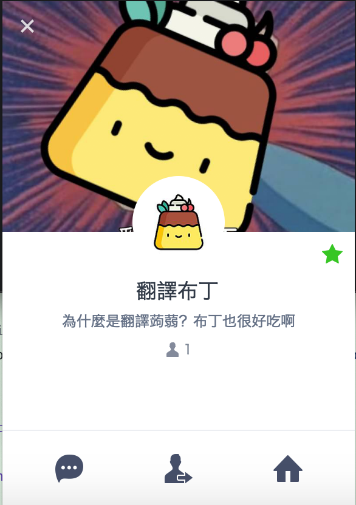

# TranslatedPudding
See here for [chinese version of readme.](./chinese_readme.md)

## What is TranslatedPudding(翻譯布丁)?
Line provides voice message which can be transmitted without type any text. But this type of message is not very convenient for message receiver.There are serveral reasons as follows: 

1. For instance, if you are in a metting or in school, **you can not understand those voice messages cause you can not repeat those voice messages**.
2. Although voice message is very convenient for message sender, but **for message receiver, voice message spends lots of time to get the content(you must repeat it again).**

So TranslatedPudding(翻譯布丁), a line chatbot is created to help you translate voice msg to text msg.

This project's name is inspired by [都拉Ａ夢-翻譯蒟蒻](http://zh.doraemon.wikia.com/wiki/%E7%BF%BB%E8%AD%AF%E8%92%9F%E8%92%BB?variant=zh-tw), just because I like eat pudding more than konjac:|

## How to Use？
Sorry, this chatbot service is not open yet(maybe will open in the feature), but I open source code and you can deploy TranslatedPudding by youself.

When deployment is finish, just add this chatbot into any group and then use it!

In this game, you are cosplay a leukocyte / erythrocyte to against enemy(virus) in the main character.
you can use virtual joystick to controll your character move, and press the shooting button to shoot bullet toward enemy.

Once you hit them three times, enemy will dizzy and become ill, at the moment you can swallow them and threw tehm up to attack others virus(enemy).

## Demo

## Game Display
## Game Features
- Creativity gamebackground .
- Innovative gameplay.
- AI enemy(I use A* algorithm to implement auto-follow-character and random attack mode.)

## How to Start
In th folder, I put the .apk file which you can just install in your android device.
And if you want to open with UNITY, you can download th package file and then just import it in UNITY.

## Use Language & Packages
- Unity
- C#
- Visual Studio

## Detail
There are two PPT in the folder, you can get the detail from them.
By the way, if you want for more detail you can see in my blog: [[專題競賽]2016波克城市數位遊戲設計-參賽心得](https://john850512.wordpress.com/2016/06/11/%E5%B0%88%E9%A1%8C%E7%AB%B6%E8%B3%BD2016%E6%B3%A2%E5%85%8B%E5%9F%8E%E5%B8%82%E6%95%B8%E4%BD%8D%E9%81%8A%E6%88%B2%E8%A8%AD%E8%A8%88-%E5%8F%83%E8%B3%BD%E5%BF%83%E5%BE%97/)
