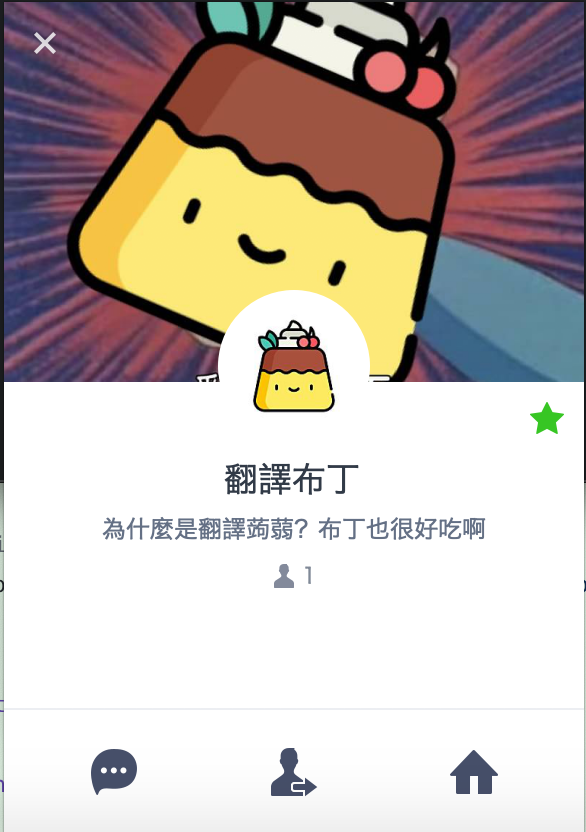

# TranslatedPudding

## 什麼是翻譯布丁?
Line提供了語音訊息的功能使得使用者可以不用輸入任何文字來發送訊息，不過這種訊息由於某些原因對於接收者並不是那麼便利:
1. 如果你在上課中或是開會中，你無法得知訊息的內容因為你無法重播語音訊息。
2. 儘管對於訊息發送者很便利，但對於訊息接收者來說浪費了大量的時間，因為他們要花費相同的時間重播一次來得知訊息內容。

所以翻譯布丁就此誕生，他可以幫助你把語音訊息轉成文字訊息使得方便閱讀。

這名字來自於[都拉Ａ夢-翻譯蒟蒻](http://zh.doraemon.wikia.com/wiki/%E7%BF%BB%E8%AD%AF%E8%92%9F%E8%92%BB?variant=zh-tw)，因為比起蒟蒻我比較喜歡吃布丁:|

## How to Play？

In this game, you are cosplay a leukocyte / erythrocyte to against enemy(virus) in the main character.
you can use virtual joystick to controll your character move, and press the shooting button to shoot bullet toward enemy.

Once you hit them three times, enemy will dizzy and become ill, at the moment you can swallow them and threw tehm up to attack others virus(enemy).

## Demo
[SaveMoreDemo_新手教學](https://youtu.be/ob6LvOYn8Yc)

## Game Display
- Multi-Character can be choosed

- Achievement System

- Game Guides

- Different Game Stages

- Boss Room

## Game Features
- Creativity gamebackground .
- Innovative gameplay.
- AI enemy(I use A* algorithm to implement auto-follow-character and random attack mode.)

## How to Start
In th folder, I put the .apk file which you can just install in your android device.
And if you want to open with UNITY, you can download th package file and then just import it in UNITY.

## Use Language & Packages
- Unity
- C#
- Visual Studio

## Detail
There are two PPT in the folder, you can get the detail from them.
By the way, if you want for more detail you can see in my blog: [[專題競賽]2016波克城市數位遊戲設計-參賽心得](https://john850512.wordpress.com/2016/06/11/%E5%B0%88%E9%A1%8C%E7%AB%B6%E8%B3%BD2016%E6%B3%A2%E5%85%8B%E5%9F%8E%E5%B8%82%E6%95%B8%E4%BD%8D%E9%81%8A%E6%88%B2%E8%A8%AD%E8%A8%88-%E5%8F%83%E8%B3%BD%E5%BF%83%E5%BE%97/)
